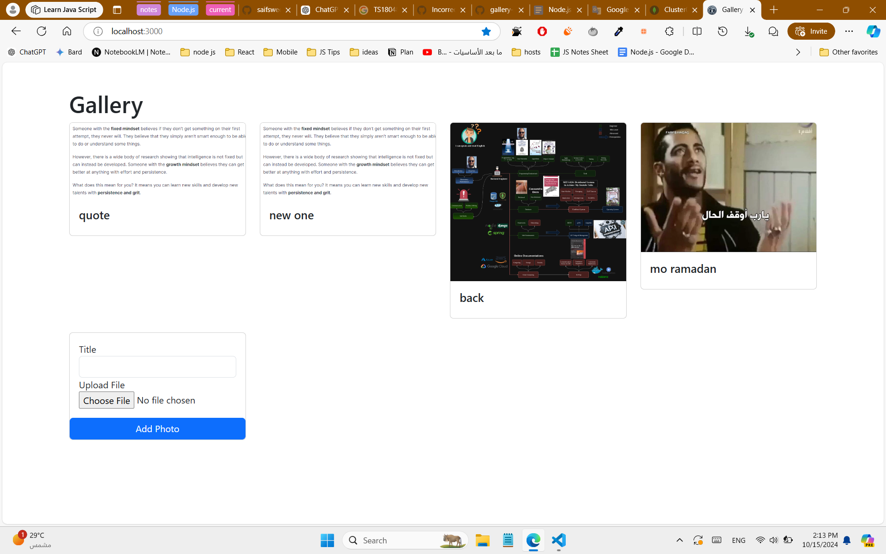

# Gallery App
This is the Gallery App Task


## Usage
* Clone the repository to your machine
* Install dependencies `npm install`
* Create .env file
```bash
PORT = 3000
DATABASE_URI=YOUR_DATABASE_URI
```
### Development Mode
```bash
npm run dev
```

### Building for production
```bash
npm run build
```

### Running distribution
```bash
npm run start
```